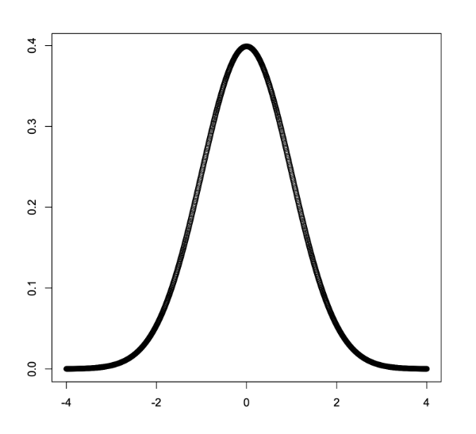

# Using Python for Research
---

## Normal Distribution

A continuous probability distribution (means that can take any value within a specific range) that is symmetrical and bell-shaped. Characterized by two parameters:
+ $\mu$ (mean): central value of an array of data after it has been sorted.
+ $\sigma$ (standard deviation): how spread out the numbers in a data set are around the mean of the set.
### Standard Deviation

When we have the data for the entire group we’re interested in:
$$
\sigma = \sqrt{\frac{\sum(x_{1}-\mu)^2}{N}}
$$
+ $x_i$ → each data point
+ $\mu$ → data points mean
+ $N$ → number of data points

Small standard deviation → data points close to the mean
Large standard deviation → data points are spread out

### Probability Density Function (PDF)

Describes the probability of a random variable of taking a particular value or falling within a specific range of values in a continuous probability distribution.

$$
f(x) = \frac{1}{\sqrt{2\pi\sigma^2}}e^-{\frac{(x-\mu)^2}{2\sigma^2}}
$$
- $\mu$ → mean of the distribution
- $\sigma$ → standard deviation
- $e$ → base of the natural logarithm

---
## Standard Normal Distribution

Normal distribution with 
- $\mu = 0$
- $\sigma = 1$

Characteristics:
- Bell-shaped curve
- Symmetric around the mean
- 95% of data falls within two standard deviations

### Z-Score

Represents how many standard deviations an element is from the mean.

$$
z = \frac{X-\mu}{\sigma}
$$
- $X$ → value from the data set

---
## **k-Nearest Neighbors (kNN)**

1. **Points have coordinates and label or numerical value.**
2. **The number `k` represents how many neighbors you will look at when making the prediction.**
3. **Measure the distance between the new point and the rest points in the dataset.**
4. **Sort the distances and pick the `k` closest points.**
5. **Calculate the average of the values of these `k` nearest neighbors and use this average as the prediction for the new point.**

